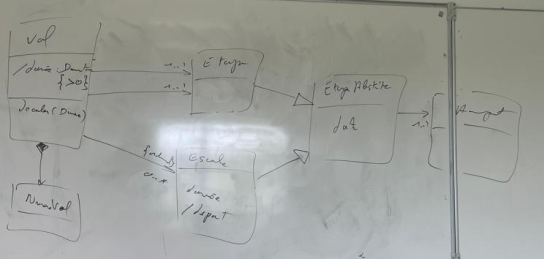
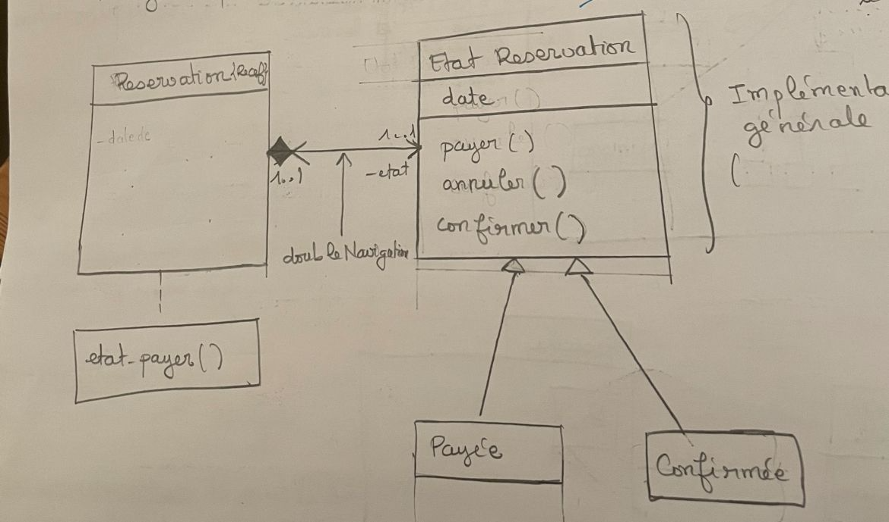

# Génie Logiciel L3 - TP4

[Sujet](https://loriscroce.frama.io/genie_logiciel_l3/tp4)


## Objectif du TP

**Implémentation de schéma UML**

Le but du TP est d'implémenter en Java le modèle étudié en TD autour de la réservation de vols.

Le sujet demandait de :

- compléter les classes fournies ;
- implémenter le modèle défini en TD ;
- commencer par une version simple ;
- gérer ensuite certaines associations avec double navigabilité ;
- produire un code propre, testable et maintenable.

Le projet fourni contenait déjà une base avec les classes principales comme `Aeroport`, `Compagnie`, `Vol`, `Reservation` et `Start`.

Mon implémentation s'appuie sur cette base, mais elle a été enrichie avec les éléments vus dans la correction du TD.  
J'ai donc essayé de faire une implémentation qui mélange la base fournie en TP avec la modélisation plus complète étudiée en TD.

---

## Organisation générale du projet

Le projet est organisé en deux packages principaux :

```text
org.uca.aeroport
org.uca.reservation
```

Le package `aeroport` contient les classes liées aux vols, aux compagnies, aux aéroports et aux étapes du trajet.

Le package `reservation` contient les classes liées aux clients, passagers, réservations et états d'une réservation.

---

## Structure du package `aeroport`

Le package `org.uca.aeroport` contient les classes suivantes :

```text
Aeroport
Compagnie
Vol
EtapeAbstraite
Etape
Escale
GenerateurNumeroVol
Money
```

### Aeroport

La classe `Aeroport` représente un aéroport.

Elle contient :

- un nom ;
- une ville.

Exemple :

```java
Aeroport cdg = new Aeroport("Charles de Gaulle", "Paris");
```

Des validations sont faites dans le constructeur pour empêcher la création d'un aéroport avec un nom ou une ville vide.

---

### Compagnie

La classe `Compagnie` représente une compagnie aérienne.

Elle contient :

- un nom ;
- une liste de vols ;
- un générateur de numéros de vols.

La compagnie est responsable de la création des vols grâce à la méthode :

```java
compagnie.creerVol(depart, arrivee);
```

Cette méthode permet :

- de générer automatiquement un numéro de vol ;
- de créer le vol ;
- d'ajouter le vol à la compagnie ;
- de maintenir la relation bidirectionnelle entre `Compagnie` et `Vol`.

La relation entre `Compagnie` et `Vol` est donc gérée avec une **double navigabilité** contrôlée.

Pour éviter les boucles infinies, des méthodes internes sont utilisées :

```java
setCompagnieWithoutBidirectional(...)
addVolWithoutBidirectional(...)
removeVolWithoutBidirectional(...)
```

---

### GenerateurNumeroVol

La classe `GenerateurNumeroVol` permet de générer automatiquement les numéros de vols.

Elle est composée par `Compagnie`.

L'idée est qu'une compagnie possède son propre générateur de numéros.

Exemple :

```java
Compagnie airFrance = new Compagnie("Air France", new GenerateurNumeroVol());
```

---

### Money

La classe `Money` représente un prix.

Elle contient :

- un montant ;
- une devise.

Le choix d'utiliser une classe `Money` permet d'éviter d'utiliser directement un `double` pour représenter un prix.

C'est plus propre, car les prix peuvent dépendre d'une devise et doivent être manipulés avec précision.

Le montant est représenté par un `BigDecimal`.

---

### Vol

La classe `Vol` représente un vol.

Elle contient :

- un numéro ;
- une compagnie ;
- une étape de départ ;
- une étape d'arrivée ;
- une liste ordonnée d'escales ;
- une liste de réservations ;
- un état ouvert ou fermé qui permet de savoir si un vol est ouvert ou fermé à la réservation.

Les principales méthodes sont :

```java
ouvrir()
fermer()
estOuvert()
creerReservation(...)
prix()
obtenirDuree()
ajouterEscale(...)
decaler(Duration duree)
```

Un vol doit être ouvert pour qu'une réservation puisse être créée.
Si le vol est fermé, une exception est levée.

---

### Décalage d'un vol

La méthode :

```java
decaler(Duration duree)
```

permet de décaler toutes les dates associées à un vol :

- la date de départ ;
- la date d'arrivée ;
- les dates des escales.

Exemple :

```java
vol.decaler(Duration.ofHours(2));
```

Cette méthode repose sur le polymorphisme de `EtapeAbstraite`.

Chaque étape du vol possède sa propre date et peut être décalée indépendamment.

---

## Modélisation des étapes et escales

La correction du TD proposait une modélisation avec une classe abstraite pour factoriser les éléments communs entre les étapes simples et les escales.
C'était la deuxième stratégie proposée en TD et c'est cette solution que j'ai choisie pour réaliser l'implémentation.
La structure est la suivante :

```text
EtapeAbstraite
      ↑
 ┌────┴────┐
Etape    Escale
```

## Diagramme UML des vols




### EtapeAbstraite

La classe abstraite `EtapeAbstraite` contient les éléments communs :

- un aéroport ;
- une date.

### Etape

La classe `Etape` représente une étape simple.

Elle est utilisée pour représenter :

- le départ du vol ;
- l'arrivée du vol.

Dans `Vol`, on a donc :

```java
private Etape depart;
private Etape arrivee;
```

### Escale

La classe `Escale` représente une escale intermédiaire.

Elle hérite de `EtapeAbstraite` et ajoute :

- une durée.

La durée d'une escale doit être strictement positive.

Cette contrainte est vérifiée dans le constructeur.

---

## Structure du package `reservation`

Le package `org.uca.reservation` contient les classes suivantes :

```text
Client
Passager
Reservation
EtatReservation
EtatInitial
EtatPayee
EtatConfirmee
EtatAnnulee
```

---

### Client

La classe `Client` représente la personne qui effectue la réservation.

Elle contient :

- un nom ;
- un moyen de paiement ;
- une adresse mail ;
- des points de fidélité.

Le client n'est pas forcément le passager.

Par exemple, une personne peut réserver un vol pour quelqu'un d'autre.

---

### Passager

La classe `Passager` représente la personne concernée par le vol.

Elle contient :

- un nom ;
- un numéro de passeport ;
- un âge ;
- un téléphone.

---

### Reservation

La classe `Reservation` représente une réservation de vol.

Elle contient :

- un numéro ;
- une date de création ;
- un prix ;
- un client ;
- un passager ;
- un vol ;
- un état courant.

Le prix est stocké au moment de la réservation.

Cela permet d'éviter qu'une modification future du prix du vol ne modifie les anciennes réservations.

Une réservation est créée par un vol avec :

```java
vol.creerReservation(client, passager);
```

Cette méthode vérifie d'abord que le vol est ouvert.

---

## Design Pattern utilisé : State

Le Design Pattern utilisé est le **Pattern State**.

Il est utilisé pour gérer les différents états possibles d'une réservation.

Une réservation peut être dans les états suivants :

```text
EtatInitial
EtatPayee
EtatConfirmee
EtatAnnulee
```

## Diagramme des états de réservation




Ces classes héritent toutes de la classe abstraite :

```java
EtatReservation
```

La classe `Reservation` possède un attribut :

```java
private EtatReservation etat;
```

Les méthodes de changement d'état sont :

```java
payer()
confirmer()
annuler()
```

La réservation délègue le changement d'état à son état courant.

Exemple :

```java
etat = etat.payer();
```

L'intérêt de ce choix est d'éviter plusieurs booléens comme :

```java
boolean payee;
boolean confirmee;
boolean annulee;
```

Avec plusieurs booléens, il serait possible d'obtenir des situations incohérentes, par exemple une réservation à la fois payée, confirmée et annulée.

Avec le Pattern State, seules les transitions autorisées sont possibles.

---

## Transitions d'état autorisées

Les transitions principales sont :

```text
Initiale -> Payée
Initiale -> Annulée
Payée -> Confirmée
Payée -> Annulée
Confirmée -> Annulée
```

Les transitions interdites lèvent une exception.

Exemples de transitions interdites :

```text
Initiale -> Confirmée
Annulée -> Payée
Annulée -> Confirmée
Payée -> Payée
```

Ces règles sont testées dans les tests unitaires.

---

## Gestion de la double navigabilité

La double navigabilité a été utilisée de manière limitée pour éviter de complexifier inutilement le modèle.

Elle est utilisée entre :

```text
Compagnie <-> Vol
```

Quand un vol est ajouté à une compagnie, le vol connaît automatiquement sa compagnie.

Quand un vol est retiré d'une compagnie, son lien vers la compagnie est supprimé.

Pour éviter les boucles infinies entre les deux classes, des méthodes internes `WithoutBidirectional` sont utilisées.

Exemple :

```java
protected void setCompagnieWithoutBidirectional(
        Compagnie compagnie
) {
    this.compagnie = compagnie;
}
```

La double navigabilité n'a pas été utilisée partout, car cela aurait rendu le code plus complexe.

Par exemple, les escales ne possèdent pas de référence inverse vers le vol.

---

## Choix de conception importants

### Création des vols

La création des vols est centralisée dans la classe `Compagnie`.

Cela permet à la compagnie :

- de générer le numéro du vol ;
- d'ajouter le vol à sa liste ;
- de maintenir la relation avec le vol.

La méthode :

```java
creerVol(...)
```
---

### Encapsulation des collections

Les collections internes ne sont pas exposées directement.

Par exemple, dans `Vol` :

```java
public List<Reservation> getReservations() {
    return Collections.unmodifiableList(reservations);
}
```

Cela empêche un utilisateur extérieur de modifier directement la liste des réservations.

Le même principe est utilisé pour les vols d'une compagnie et pour les escales d'un vol.

---

### Validations métier

Des validations sont faites dans les constructeurs et les méthodes importantes.

Exemples :

- un aéroport doit avoir un nom et une ville ;
- une escale doit avoir une durée strictement positive ;
- un client doit avoir un nom, un moyen de paiement et un mail ;
- un passager doit avoir un numéro de passeport ;
- un vol doit avoir une date d'arrivée après la date de départ ;
- une réservation ne peut pas être créée sur un vol fermé ;
- une réservation annulée ne peut plus être payée ni confirmée.

---

## Tests unitaires

Des tests JUnit ont été ajoutés pour vérifier le comportement du projet.

Les tests se trouvent dans :

```text
src/test/java/org/uca
```

Les fichiers de tests sont :

```text
AeroportTest
ClientTest
CompagnieTest
EscaleTest
EtatReservationTest
GenerateurNumeroVolTest
MoneyTest
PassagerTest
ReservationTest
VolTest
```

Les tests vérifient notamment :

- la création des objets métier ;
- les validations des constructeurs ;
- la génération des numéros de vols ;
- l'ouverture et la fermeture d'un vol ;
- la création d'une réservation ;
- l'impossibilité de réserver un vol fermé ;
- la double navigabilité entre `Compagnie` et `Vol` ;
- les transitions du Pattern State ;
- les transitions interdites ;
- la contrainte de durée positive pour les escales ;
- la validité des prix.

---

## Scénario de démonstration

Le fichier `Start.java` contient un scénario de démonstration.

Il permet de créer :

- un vol direct ;
- un vol avec escale ;
- un client ;
- un passager ;
- une réservation ;
- un paiement ;
- une confirmation ;
- des erreurs métier attendues.

Ce fichier ne remplace pas les tests unitaires.  
Il sert seulement à montrer rapidement le fonctionnement global du projet.

---

## Compilation du projet

Pour compiler le projet :

```bash
./gradlew build
```

---

## Lancement des tests

Pour exécuter les tests :

```bash
./gradlew test
```

---

## Exécution du programme

Pour lancer le programme principal :

```bash
./gradlew run
```

---


## Conclusion

Ce projet implémente le modèle UML de réservation de vols en s'appuyant sur la correction du TD et sur le squelette fourni en TP.

Les choix principaux sont :

- une séparation entre les packages `aeroport` et `reservation` ;
- une modélisation des étapes par héritage avec `EtapeAbstraite`, `Etape` et `Escale` ;
- une création des vols centralisée dans `Compagnie` ;
- une double navigabilité contrôlée entre `Compagnie` et `Vol` ;
- une séparation entre `Client` et `Passager` ;
- un prix stocké au moment de la réservation ;
- l'utilisation du Pattern State pour gérer les états d'une réservation ;
- des tests unitaires pour vérifier les comportements importants.

L'objectif a été de produire une implémentation cohérente avec le modèle UML, tout en gardant un code simple, lisible et maintenable.